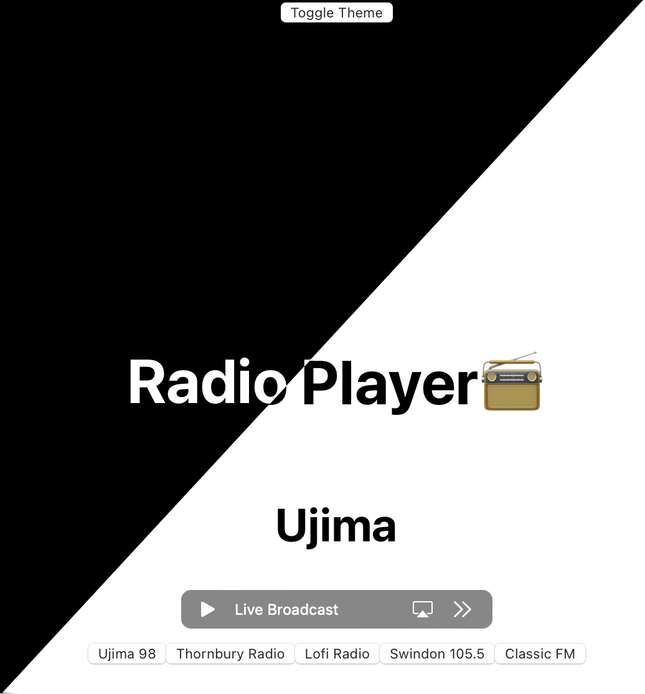

# Web Radio player app

https://radio-browser-ebon.vercel.app

this is a simple app that plays a selection of online radio stations from around the birstol area, It has sevral features such as rembering last station used via local storage and peristent light dark mode . intergrations via supabse are included 

there is plans to add more stations and streamline the code to make it more dynamic 

## Tech Stack

- React
- Supabase
- Vercel

## Changes 

- Added light / Dark Mode 
    -   Plans to add system pref themeing too 
- remember last station in local storage 
- moved station list to a database (Supabase)

## Planed Changes 

- add user account and favorite mode 
- major Ui overhall 
    -   it is currently using the standard create react app style and theme  
